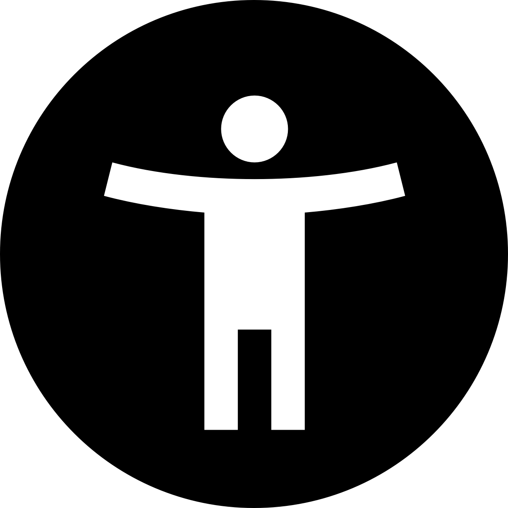

---  
    posttype: blog
    slug: digital-accessibility
    date: 2020-10-01
    category: Accessibility
    addtohomepage: false
    title: Creating digital interfaces and disabilities
    coverimage:
    intro: The introduction to the models of disability, Medical, Charitable, Social and Human rights was new to me and has enhanced my understanding of a person with a disability. I am inspired how the Social model describes a person is disabled by the barriers they encounter in our society contrary to their impairment.
---

<!-- 
 

   

 -->

<h3>Digital Accessibility Fundamentals</h3>

The introduction to the models of disability, Medical, Charitable, Social and Human rights was new to me and has enhanced my understanding of a person with a disability. I am inspired how the Social model describes a person is disabled by the barriers they encounter in our society contrary to their impairment. 1,2

It has highlighted to me that by creating a digital interface for users can also create a disability or barrier, if that interface does not have sufficient support for impaired users. This can be an unpleasant idea to accept for a digital interface creator or organisation who may have genuine accessibility goals, but face obstacles when including accessibility. These obstacles could include absence of regulation and legal requirements, internal processes to follow, agreed project requirements, the availability of suitable resources or the perception of lower profitability.

I now appreciate when an accessibility information area within a digital interface has been implemented. An area that describes the continual efforts being taken to implement accessibility and what efforts have been made. This can be interpreted by a user as a progressive and positive feature, adds a layer of transparency and a simple way to check if there has been an effort to meet accessibility requirements for a user. Such an area could also indicate content in more alternative suitable formats such as an accessible PDF, what features have been implemented, support for assistive technologies, browsers and mobile devices. An area that invites the user for feedback on accessibility will reinforce the idea of inclusion and help develop accessible priorities, suitable solutions and help make digital interfaces work for everyone.

References
1.	Disability Advocacy Resource Unit. How we talk about disability matters. Retrieved from http://www.daru.org.au/how-we-talk-about-disability-matters
2.	Scope - Equality for disabled people. Social Model. Video. Retrieved from https://www.youtube.com/watch?v=3m_EbRH1aF4&feature=emb_title

