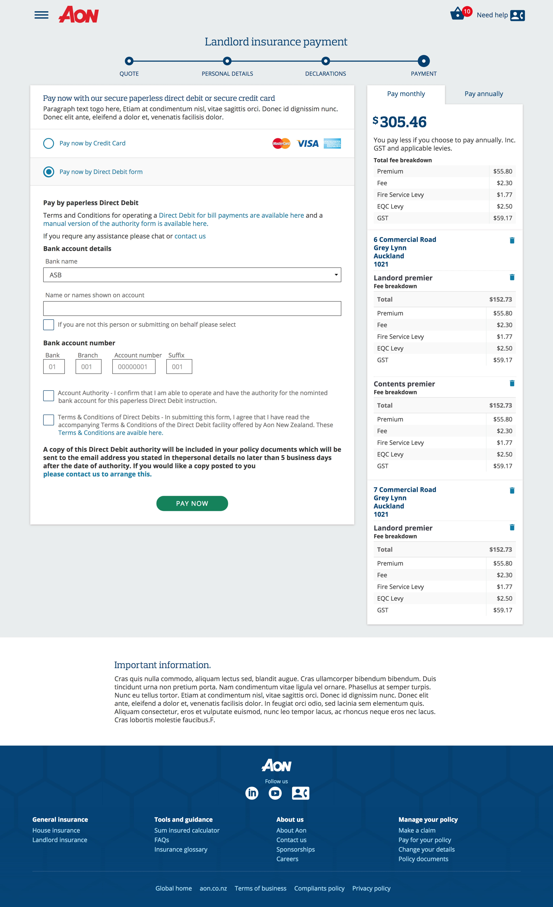

---  
    posttype: project
    slug: aon
    date: 2018-02-01
    category: Website
    url: http://aon.co.nz
    addtohomepage: true
    title: AON Insurance
    coverimage: ./thumb@2x.jpg
    intro: Wireframes, UI design & templates.
---

AON Insurance bringing their products online. Their first project was to create a web presence for their Landlord Insurance.

I designed and wireframes, user flows, hi definition mocks and HTML prototypes for their stakeholders. I was also asked to create the templates for the integration team.

The client asked that accessibility be a focus. Web Content Accessibility Guidelines (WCAG) for AA colour contrast standards and accessible keyboard navigation.

 

