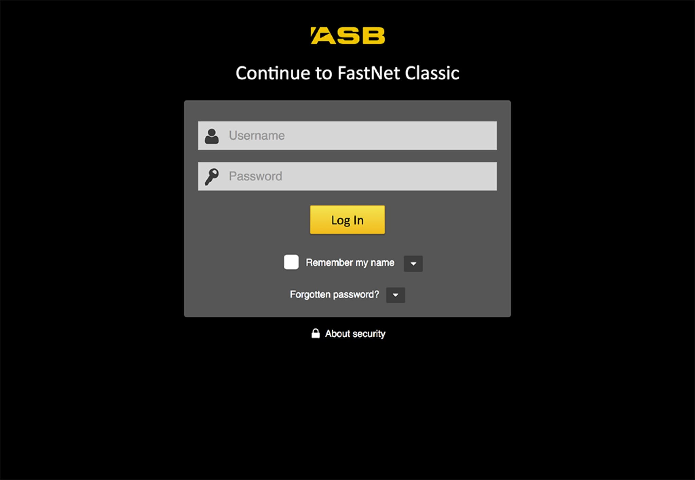
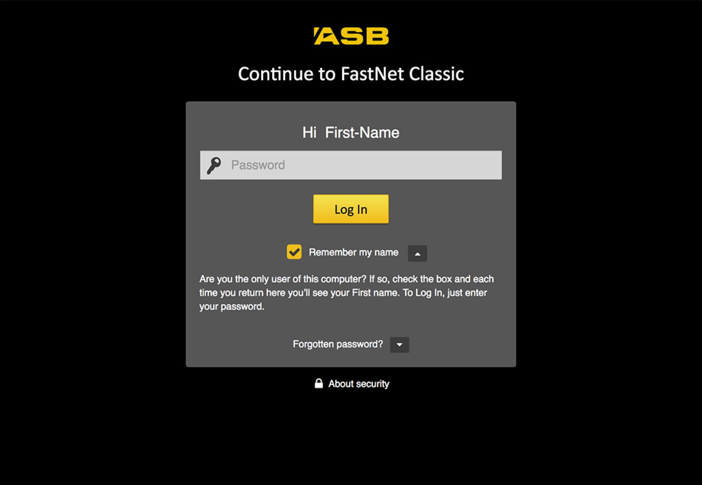
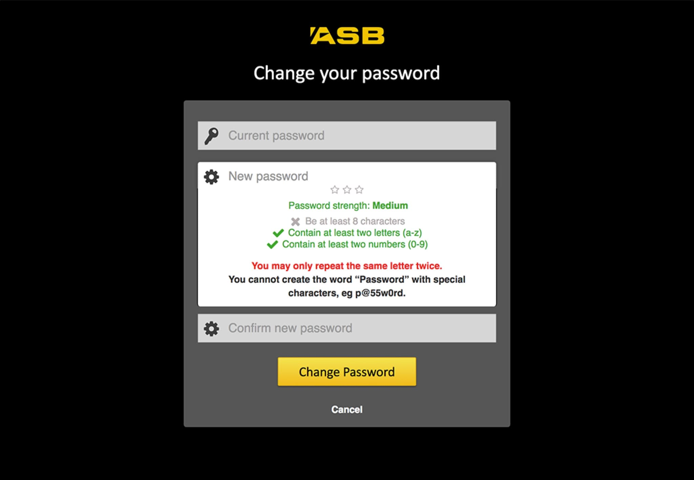

---  
    posttype: project
    slug: asb
    date: 2016-08-01
    category: Website
    url: http://asb.co.nz
    addtohomepage: true
    title: ASB - Single Sign On
    coverimage: ./thumb@2x.jpg
    intro: Wireframes, user flows, hi definition mocks and HTML prototypes for their stakeholders.
---

ASB bank Single Sign On for their banking products. ASB’s vision was to have a consistent UI login experience across their products. A consistent look with minimal disruption to their users and Call Centre.

I created wireframes, user flows and hi definition mocks for stakeholders. HTML prototypes were also created for their integration team.

