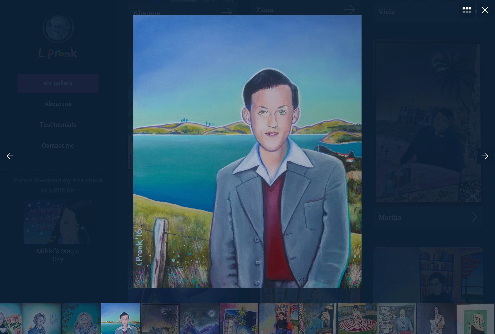
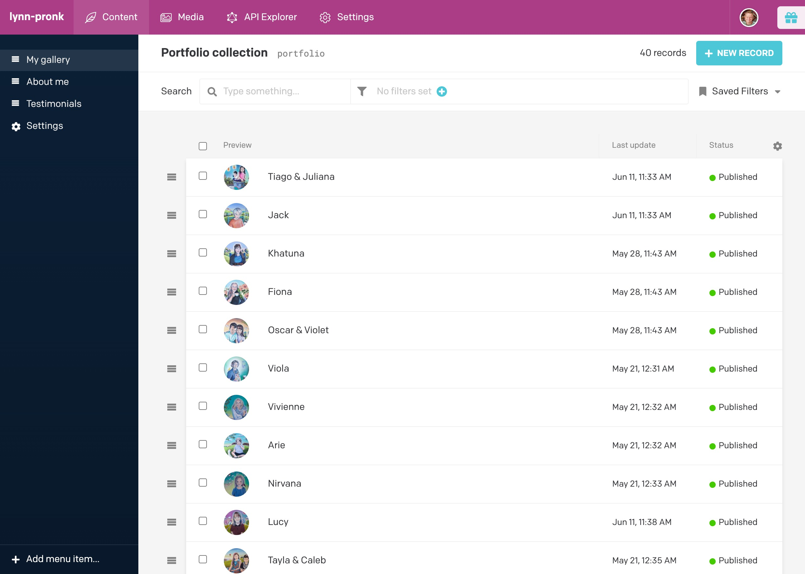
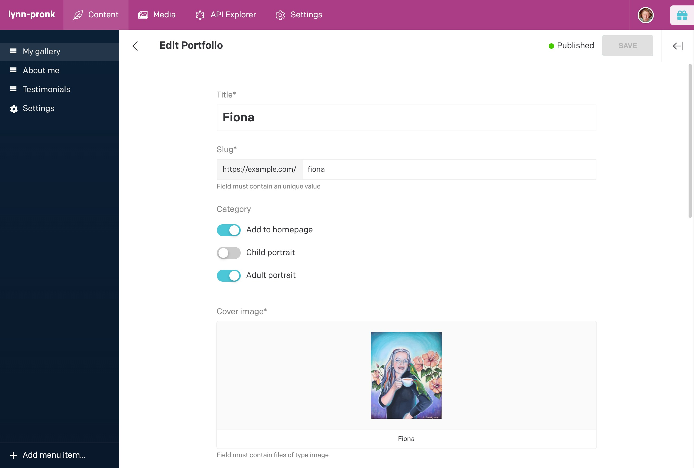

---  
    posttype: project
    slug: lynn-pronk-portraits
    date: 2020-03-01
    category: Website
    url: https://www.lynnpronkportraits.com
    addtohomepage: true
    title: Lynn Pronk Portraits
    coverimage: ./thumb@2x.jpg
    intro: A portfolio website designed and built for a portrait artist.
---

A portfolio design and build for a portrait artist. Displaying the artwork at its best, fitting the browser window where possible and the ability to zoom on images was the client request/requirement.

The client also requested a straight forward, easy to use Content Management System as the technical skills of the client are proudly not the best.

Peter has created two websites for me. The original one, using a standardised commercial template, was great, but the new one is superior in every way.

Using a template Peter has designed himself, my new website feels individually tailor made to showcase my portrait work.

The viewer is more immediately engaged with the images in a dynamic and more interactive way.

The website downloads incredibly quickly.

And maybe best of all Peter has made the administration side of the website super easy. Now, even a techno luddite like me can control and edit most of the material myself, which I definitely couldn’t do before. **Very empowering!**

Thanks Peter for my new website! I’m so thrilled with it.

Lynn Pronk

