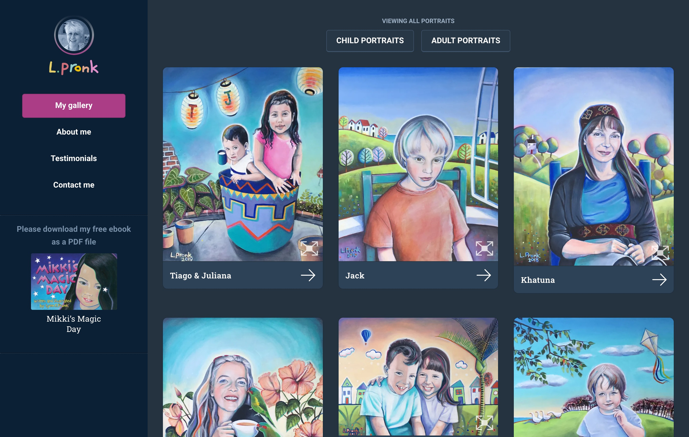

---  
    posttype: project
    slug: lynn-pronk-portraits
    date: 2019-05-01
    category: Website
    url: https://www.lynnpronkportraits.com
    addtohomepage: true
    title: Lynn Pronk Portraits
    coverimage: ./lynn-pronk-a.jpg
    intro: This is a portfolio website designed and built for Lynn Pronk, a portrait artist.
---

This is a portfolio website designed and built for Lynn Pronk, a portrait artist. Displaying the artwork at its best, fitting the browser window where possible was a  client request. Along with being able to zoom in on images.

The client requested a straight forward, easy to use Content Management System (CMS) as the technical skills of the client are proudly not the best.

