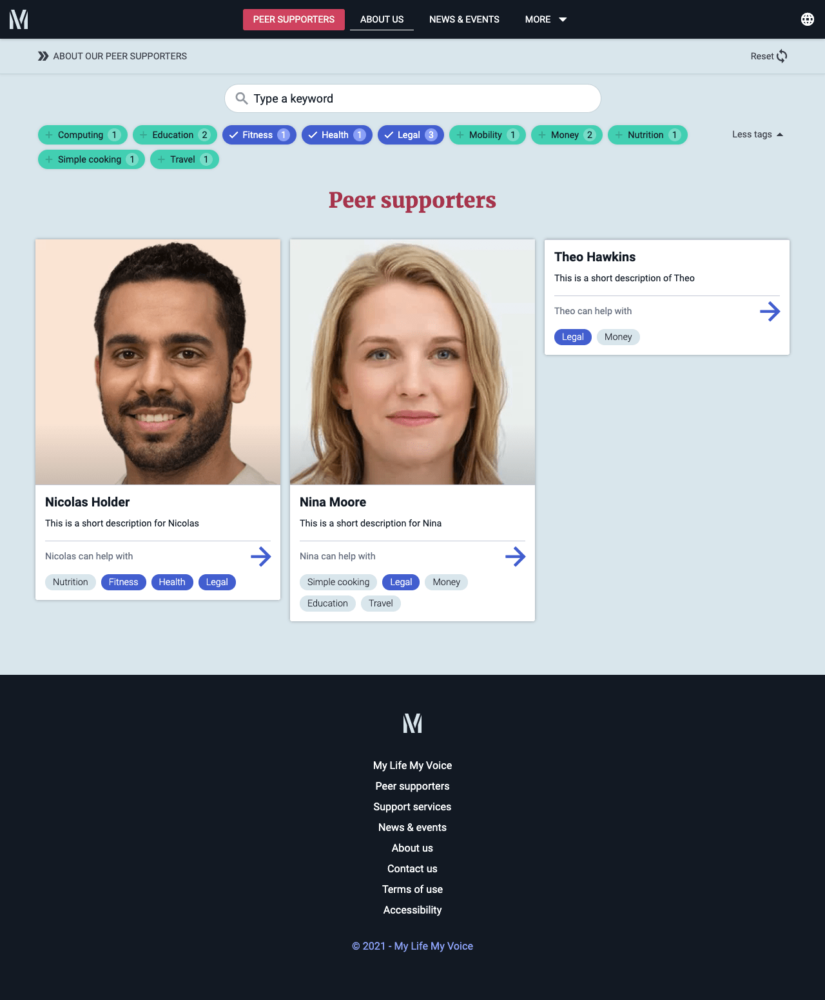

---  
    posttype: project
    slug: mlmv
    date: 2021-01-01
    category: Website & Progressive Web App
    url: https://dev-mlmv.netlify.app
    addtohomepage: true
    title: My Life My Voice
    coverimage: ./homepage-1.0.png
    intro: A website for the disabled community.
---

A website for the disabled community. Connecting experienced Peer supporters to individuals with impairments to help them achieve their goals.

Built with React, Sanity and GraphQL. Locale internationalistion implemented.

