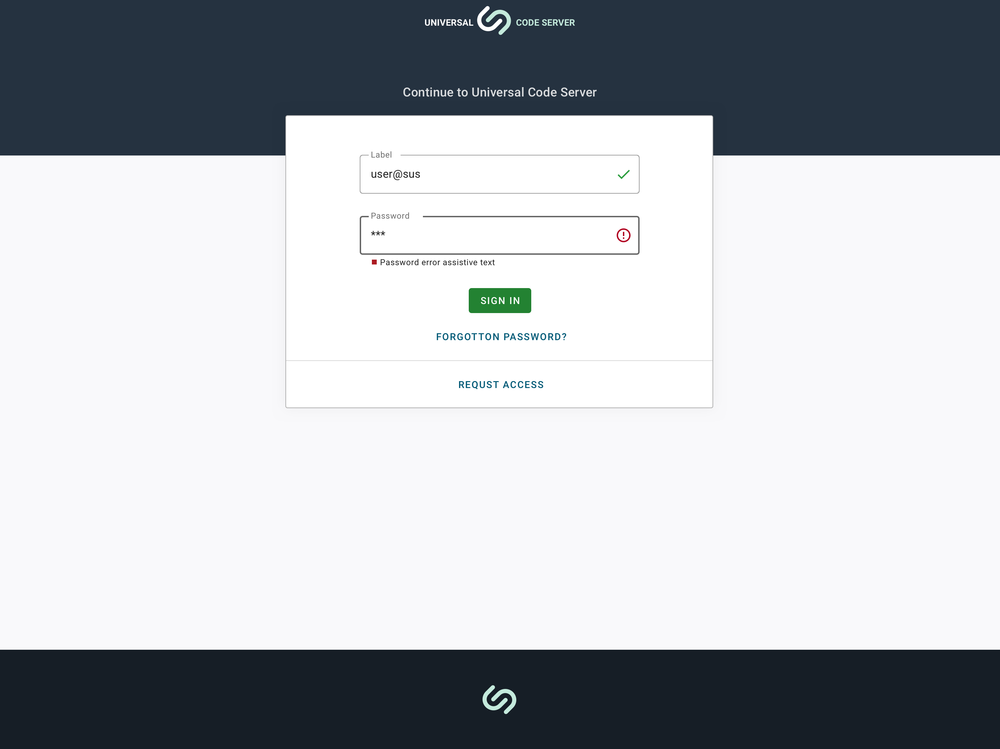
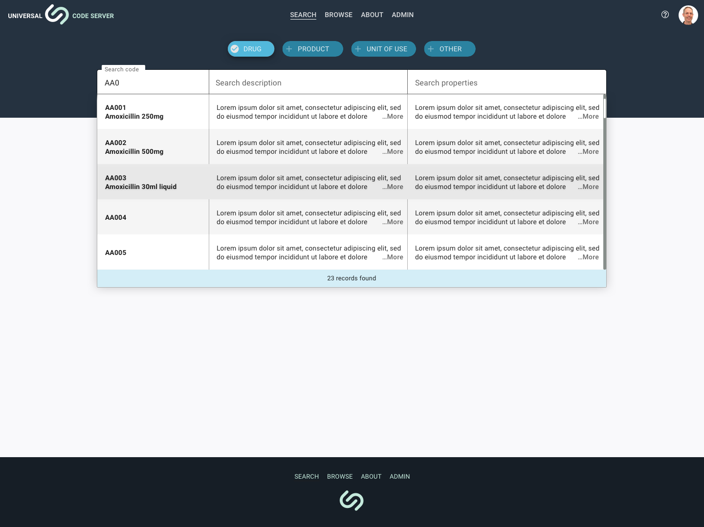

---  
    posttype: project
    slug: sustainable-solutions-ucs
    date: 2020-08-01
    category: Web application
    url: https://sussol.net
    addtohomepage: true
    title: Sustainable Solutions - Universal Code Server
    coverimage: ./sign-in-1.2.png
    intro: Web application for management and distribution of pharmicutical products.
---

A web application for pharmaceutical supply chain software is used in national drug distribution projects, warehouses and hospitals in more than 20 countries around the world. Screen designs are of the search functionality for desktop and mobile.

A pattern library was created for the components using [Material-UI](https://material-ui.com) as the design framework.

