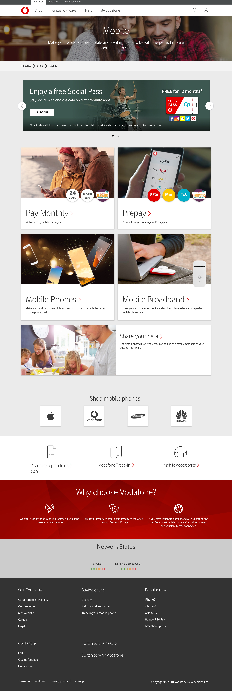
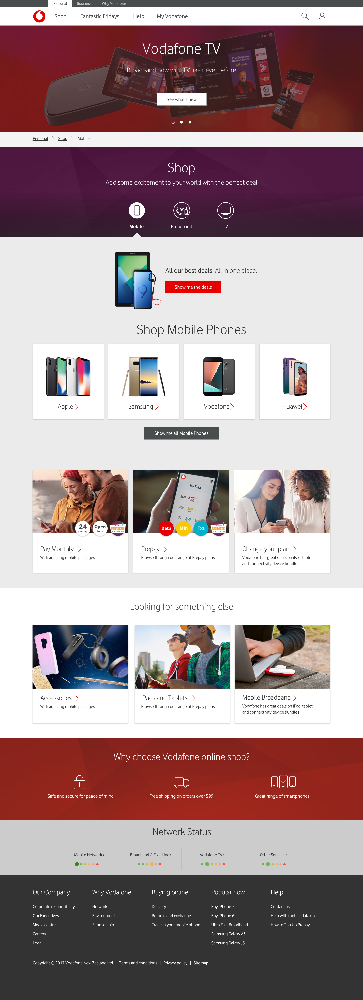
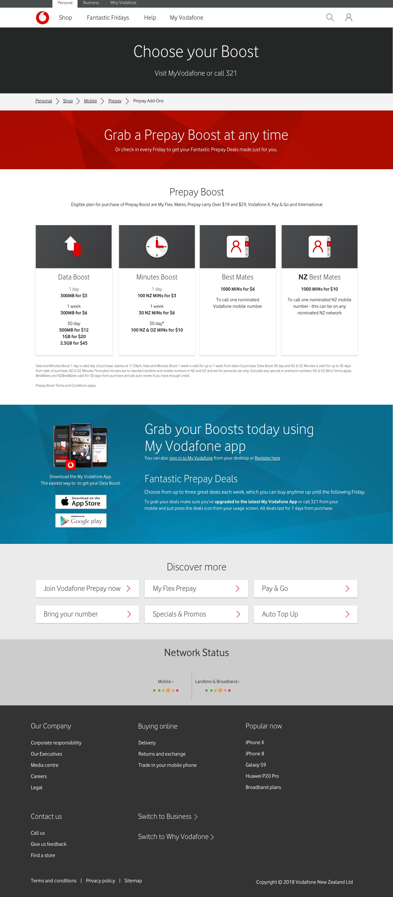
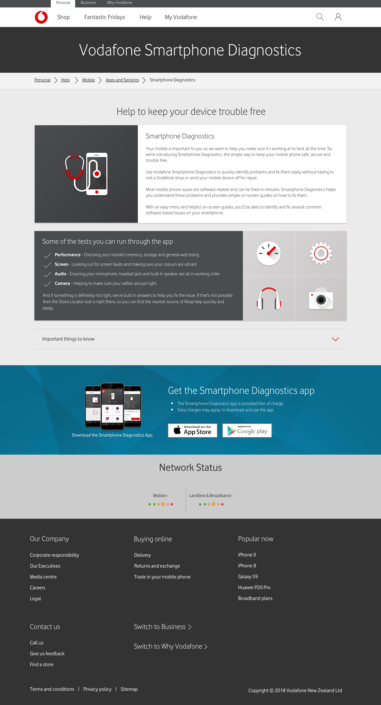

---  
    posttype: project
    slug: vodafone-nz
    date: 2018-08-01
    category: Website
    url: http://vodafone.co.nz
    addtohomepage: true
    title: Vodafone New Zealand
    coverimage: ./thumb@2x.jpg
    intro: Implemented a UI design refresh of new digital brand guidlines across legacy pages.
---

Implemented a UI design refresh of new digital brand guidlines across legacy pages.

Re-design and rebuild web pages, journeys, components and assets.

Create hi-fi designs ensuring brand guidelines are adhered to and adjust
those guidelines where appropriate to achieve a desired result. Deliverables
included design files built, managed and styled at a component level,
presented for a range of screen sizing and collaborate with stakeholders.

Design, build, maintain and manage style guides and pattern libraries.
Ensure brand and style consistency across digital touchpoints and
channels allowing designers to use consistent components from a shared
source.

 

 

